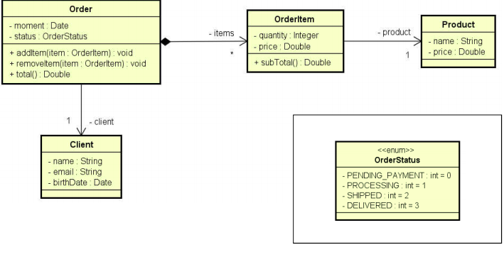
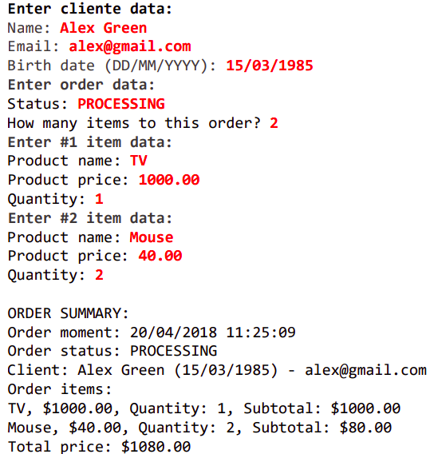

# [java-compostion_Ex3](https://www.udemy.com/course/java-curso-completo)
Exercise about enumeration and composition

**- seção 13: Enumeratio and Composition**

### Objective: 
Read the data from an order with N items ('N' is set by the user). Then, show a sumary 
as shown in the 'example' below.

The instant of the order should be the same of the system: new Date()

## System model - uml

  

### Objects

  

## Example

    

